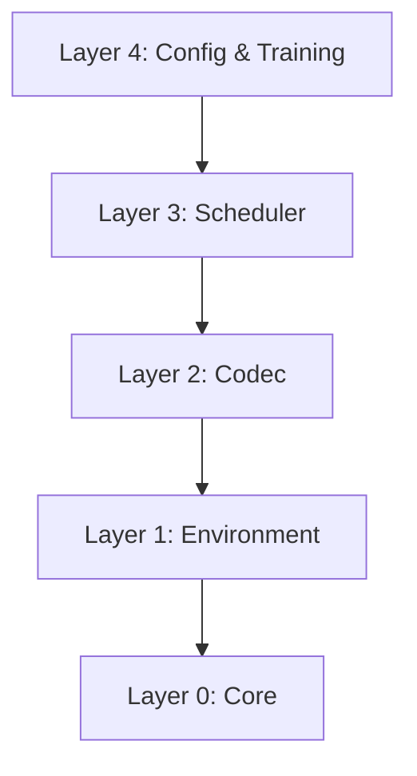

# GEMINI.md — Quy tắc dự án & Kiến trúc hệ thống

## ⚠️ QUY TẮC TỐI THƯỢNG (MANDATORY RULES)

*   **Không chạy `python` trực tiếp.** Dự án này quản lý dependency qua `uv`. Mọi câu lệnh chạy code python đều PHẢI bắt đầu bằng `uv run python`. Thằng nào chạy `python` trực tiếp làm chó.
*   **Không tự sửa `pyproject.toml`.** Mọi dependency mới phải được cài bằng `uv add <dependency>`.
*   **Không code tùy tiện.** Phải tuân thủ đúng phân lớp kiến trúc bên dưới.

---

## 🏗️ KIẾN TRÚC HỆ THỐNG (SYSTEM ARCHITECTURE)

Hệ thống được thiết kế theo phân lớp rõ ràng (Layered Architecture). Cấm import chéo giữa các tầng không liên quan.



### Chi tiết các phân lớp:

#### 1. Layer 0: Core (`core/`)
*   [types.py](file:///f:/rl-project/core/types.py): Định nghĩa các cấu trúc dữ liệu cơ bản (`Request`, `SchedulerAction`, `ActionType`).
*   [constants.py](file:///f:/rl-project/core/constants.py): Các tham số cố định hệ thống (VRAM capacity, KV cache block size, page size, max batch, v.v.).
*   [workload.py](file:///f:/rl-project/core/workload.py): Trình sinh request ngẫu nhiên theo phân phối Poisson (`WorkloadGenerator`).

#### 2. Layer 1: Environment (`env/`)
*   [memory.py](file:///f:/rl-project/env/memory.py): Quản lý VRAM và KV Cache thông qua mô phỏng PagedAttention.
*   [reward.py](file:///f:/rl-project/env/reward.py): Hàm tính toán reward cho RL (phạt SLA, phạt TTFT, phạt hàng đợi, phạt OOM/Crash).
*   [metrics.py](file:///f:/rl-project/env/metrics.py): Thu thập chỉ số hiệu năng (throughput, completion rate, SLA violations, TTFT, turnaround time).
*   [llm_env.py](file:///f:/rl-project/env/llm_env.py): Môi trường Gym mô phỏng LLM Serving scheduler (`LLMEnvSimple`).
*   [sb3_wrapper.py](file:///f:/rl-project/env/sb3_wrapper.py): Wrapper bọc Gym Env tương thích hoàn toàn với Stable-Baselines3 (SB3) và action masking.

#### 3. Layer 2: Codec (`codec/`)
*   [obs_encoder.py](file:///f:/rl-project/codec/obs_encoder.py): Mã hóa trạng thái môi trường (Queues, Batch, Memory) thành numpy array làm observation space cho RL.
*   [action_decoder.py](file:///f:/rl-project/codec/action_decoder.py): Giải mã hành động từ RL action space (số nguyên) thành lệnh điều khiển scheduler (`SchedulerAction`).

#### 4. Layer 3: Scheduler (`scheduler/`)
*   [base.py](file:///f:/rl-project/scheduler/base.py): Base class định nghĩa interface chung cho mọi Scheduler.
*   [fcfs.py](file:///f:/rl-project/scheduler/fcfs.py): Lập lịch First-Come-First-Served.
*   [edf.py](file:///f:/rl-project/scheduler/edf.py): Lập lịch Earliest-Deadline-First.
*   [priority.py](file:///f:/rl-project/scheduler/priority.py): Lập lịch theo độ ưu tiên request (Priority).
*   [rl_agent.py](file:///f:/rl-project/scheduler/rl_agent.py): Wrapper chạy mô hình MaskablePPO đã huấn luyện.

#### 5. Layer 4: Config & Training (`configs/`, `training/`)
*   [configs/default.py](file:///f:/rl-project/configs/default.py): Dataclass cấu hình workload, phần thưởng và tham số training.
*   [training/train.py](file:///f:/rl-project/training/train.py): Pipeline huấn luyện MaskablePPO kèm checkpointing.
*   [training/evaluate.py](file:///f:/rl-project/training/evaluate.py): Bộ đánh giá đơn lẻ và so sánh hiệu năng giữa các thuật toán.

---

## 🚀 HƯỚNG DẪN CHẠY CLI (`main.py`)

Mọi lệnh PHẢI bắt đầu bằng `uv run`.

### 1. Chạy thử nghiệm ngẫu nhiên (Smoke Test)
Chạy thử 1 episode với random policy để kiểm tra tính toàn vẹn hệ thống:
```bash
uv run python main.py smoke-test
```

### 2. So sánh các thuật toán Baseline
So sánh FCFS, EDF và Priority trên 10 episodes (mỗi episode 5000 steps):
```bash
uv run python main.py compare
```

### 3. Huấn luyện mô hình RL (MaskablePPO)
Huấn luyện mô hình RL với cấu hình mặc định (lưu checkpoint trong `checkpoints/` và logs trong `tb_logs/`):
```bash
uv run python main.py train
```

### 4. So sánh Baseline với mô hình RL cụ thể
```bash
uv run python main.py compare <path_to_model_zip>
# Ví dụ:
uv run python main.py compare checkpoints/best_model.zip
```

### 5. Đánh giá riêng biệt mô hình RL
Đánh giá chi tiết hiệu suất của mô hình RL:
```bash
uv run python main.py evaluate <path_to_model_zip>
# Ví dụ:
uv run python main.py evaluate checkpoints/best_model.zip
```
